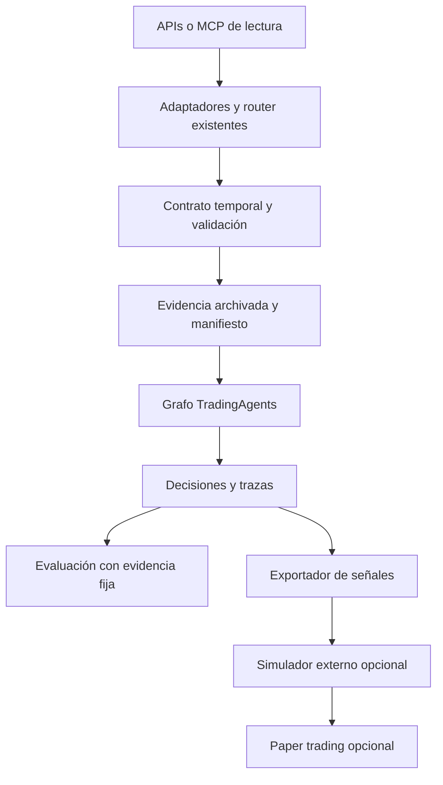

# TradingAgents: investigación de recursos y plan de adopción

**Consulta:** 3 de octubre de 2026. **Checkout analizado:** `8b22d43d01d9ddda5d686d093d5385884622f3de`, versión declarada v0.5.2. **Alcance:** análisis estático y documentación pública; sin instalar integraciones, ejecutar operaciones ni medir rentabilidad.

La mayor oportunidad es convertir TradingAgents en una plataforma de investigación **reproducible, medible y trazable**. Recomiendo empezar por evidencia congelada, evaluación de agentes y entornos fijados; después comparar un proveedor de datos adicional y adaptar procedimientos financieros existentes. La simulación de cartera merece una capa separada si el objetivo incluye ejecución.

Esta prioridad es una **inferencia de ingeniería**, no un resultado experimental. Las fuentes verifican capacidades de herramientas; ninguna demuestra que incorporarlas genere alpha en este checkout.

## 1. Qué hay realmente en el proyecto

El flujo es: analistas en paralelo → debate bull/bear → Research Manager → Trader → debate de riesgo → Portfolio Manager. Python, LangGraph/LangChain, Pydantic y CLI Typer/Rich forman la base. El [artículo original](https://arxiv.org/abs/2412.20138) explica el diseño; sus resultados no certifican los modelos ni el código de esta versión.

| Capacidad local | Evidencia en el checkout | Consecuencia para la investigación |
|---|---|---|
| Router por herramienta/categoría, proveedores explícitos y errores tipados | [router.py](../../TradingAgents/tradingagents/dataflows/router.py), [errors.py](../../TradingAgents/tradingagents/dataflows/errors.py) | Ampliar este contrato, conservar fallbacks explícitos |
| Yahoo, Alpha Vantage, SEC EDGAR, FRED y Polymarket; fuentes sociales Reddit/StockTwits | [vendors](../../TradingAgents/tradingagents/dataflows/vendors), [default_config.py](../../TradingAgents/tradingagents/default_config.py) | Son capacidades existentes, no propuestas nuevas |
| Fecha y símbolo inyectados; límites temporales; filings y vintages históricos | [tools.py](../../TradingAgents/tradingagents/agents/tools.py), [sec_edgar.py](../../TradingAgents/tradingagents/dataflows/vendors/sec_edgar.py), [fred.py](../../TradingAgents/tradingagents/dataflows/vendors/fred.py) | Un MCP nuevo debe preservar estas garantías |
| Salidas estructuradas, checkpoints y memoria temporal | [schemas.py](../../TradingAgents/tradingagents/agents/schemas.py), [checkpointer.py](../../TradingAgents/tradingagents/graph/checkpointer.py), [memory/log.py](../../TradingAgents/tradingagents/memory/log.py) | No hace falta sustituir el framework |
| Evaluador de ratings por ticker/fecha | [backtest.py](../../TradingAgents/tradingagents/backtest.py) | No es simulador de posiciones, caja o fills; el propio módulo lo declara |
| Contexto de cartera recibido por JSON | [portfolio.py](../../TradingAgents/tradingagents/portfolio.py) | Informa al agente; no representa un broker ni un ledger |
| Callbacks y configuración en reportes | [trading_graph.py](../../TradingAgents/tradingagents/graph/trading_graph.py) | Buen punto de observabilidad, con metadatos todavía ampliables |
| Tests y CI de Python 3.11–3.14, zona horaria alternativa y Ruff | [ci.yml](../../TradingAgents/.github/workflows/ci.yml), [tests](../../TradingAgents/tests) | Extender pruebas existentes; no recomendar empezar CI desde cero |

**Tres brechas concretas.** Primero, `backtest.py` reconoce feeds textuales sin archivo y una muestra del modelo por celda; su alpha se recupera del log redondeado. Segundo, no se encontró lockfile y `run_settings()` no incluye commit, hashes de evidencia ni todos los parámetros de generación. Tercero, el snapshot de mercado llama directamente a Yahoo y `memory/settlement.py` importa sus cierres: añadir precios al router no cambia esas rutas.

El README habla de ejecución en un exchange simulado, pero el contrato explícito del evaluador y el contexto de cartera no implementan esa promesa como un motor de ejecución. Para esta recomendación prevalece el código inspeccionado.

## 2. Selección principal

P0 = fundamento inmediato; P1 = siguiente piloto; P2 = condicionado al objetivo. Esfuerzo relativo, no presupuesto cerrado. “Verificado” significa documentación consultada, no instalación probada.

| Prioridad | Recurso y fuente primaria | Valor incremental y punto de entrada | Esfuerzo / costo o límite |
|---|---|---|---|
| P0 | [uv](https://docs.astral.sh/uv/concepts/projects/sync/) | Fijar dependencias y ejecutar CI con lock; `pyproject.toml` y workflow | Bajo; validar resolución en matriz Python antes de adoptar |
| P0 | [LangSmith](https://docs.langchain.com/langsmith/evaluation) **o** [Phoenix](https://arize.com/docs/phoenix) | Experimentos sobre evidencia fija, traces, costo y latencia; callbacks del grafo | Medio; elegir uno. SaaS o despliegue propio tienen costos operativos |
| P0 | [DuckDB + Parquet](https://duckdb.org/docs/current/data/parquet/overview) | Consultar archivo de evidencia y resultados numéricos por run | Medio; el archivo, permisos y modelo temporal se construyen en el proyecto |
| P0 | [LangChain Docs/Reference MCP](https://docs.langchain.com/use-these-docs) | Documentación actual durante mantenimiento de `graph/` y `llm_clients/` | Bajo; sólo entorno de desarrollo |
| P1 | [Anthropic Financial Services](https://github.com/anthropics/financial-services) | Adaptar procedimientos de earnings, comparables, DCF y revisión de tesis | Medio; skills orientadas a Claude, no integración automática LangGraph |
| P1 | [Pandera](https://pandera.readthedocs.io/en/latest/dataframe_schemas.html) | Validación tabular uniforme antes de renderizar OHLCV/fundamentales | Bajo–medio; no reemplaza reglas financieras propias |
| P1 | [exchange_calendars](https://github.com/gerrymanoim/exchange_calendars) | Grillas de sesiones, festivos y cierres; `iter_grid()` y frescura | Bajo–medio; verificar cobertura de cada bolsa |
| P1 | [Massive](https://www.massive.com/docs/ai-tools/quickstart) **o** [Alpaca Market Data](https://docs.alpaca.markets/us/docs/about-market-data-api) | Segunda fuente de precios; comparar disponibilidad y diferencias | Medio; feed y permisos del plan importan; neutralizar snapshot y settlement |
| P1 | [Financial Datasets](https://docs.financialdatasets.ai/api/financials/income-statements) | Contrastar estados normalizados con SEC y procedencia de filings | Medio; demostrar semántica de revisiones y publicación antes de backtest |
| P1 | [LangChain MCP adapters](https://github.com/langchain-ai/langchain-mcp-adapters) + [Inspector](https://github.com/modelcontextprotocol/inspector) | Piloto MCP de lectura con contrato comprobable | Medio; preservar cutoff, símbolo, errores, autenticación y catálogo por rol |
| P1 | [pip-audit](https://github.com/pypa/pip-audit) | Auditoría de dependencias resueltas en CI | Bajo; vulnerabilidades conocidas, no auditoría completa |
| P2 | [vectorbt](https://vectorbt.dev/api/portfolio/base/) | Simular señales congeladas con caja, fees y slippage | Medio; primero definir conversión de ratings a posiciones |
| P2 | [Alpaca MCP](https://github.com/alpacahq/alpaca-mcp-server) / [CLI](https://docs.alpaca.markets/us/docs/alpacas-cli) | Operación de piloto y futura fase paper | Medio–alto; herramientas de órdenes separadas del catálogo analítico; CLI en alpha preview |

**Stack inicial sugerido:** uv + documentación LangChain + una plataforma de evaluación + archivo de evidencia sencillo. DuckDB es conveniente cuando el volumen justifique consultas; para el primer piloto bastan archivos versionados con manifiesto. Luego, una sola skill financiera y un único segundo feed.

## 3. Skills: cuáles existen y cómo usarlas

Hay tres capas distintas: skills para quien desarrolla el repositorio; procedimientos financieros para mejorar informes; herramientas MCP que el proceso Python consume. Instalar una skill o MCP en Codex/Claude no los hace visibles a los agentes de TradingAgents.

El repositorio oficial de [Anthropic Financial Services](https://github.com/anthropics/financial-services) ofrece los bundles `financial-analysis` y `equity-research`, actualmente dentro de `plugins/vertical-plugins/`. Es la fuente más directamente aplicable encontrada para métodos de earnings, comparables y modelado. Conviene extraer una rúbrica pequeña, respetar licencia/atribuciones y convertir cálculos en funciones determinísticas. Los conectores empresariales allí enumerados no incluyen automáticamente las suscripciones a sus datos.

La [especificación Agent Skills](https://agentskills.io/specification) sirve para empaquetar instrucciones, referencias y scripts. Propongo crear estas skills del proyecto —son propuestas propias, **no paquetes descubiertos**:

| Skill propuesta | Resultado verificable |
|---|---|
| `tradingagents-provider-contract` | Checklist y fixtures de fecha, símbolo, unidades, fallbacks y procedencia para cada vendor |
| `tradingagents-backtest-audit` | Revisión de universo, ventanas, memoria, evidencia y costos antes de interpretar un experimento |
| `tradingagents-research-review` | Afirmaciones numéricas ligadas a evidencia, supuestos explícitos y contradicciones entre analistas |
| `tradingagents-release-check` | Tests existentes, revisión de lock, clientes LLM y configuración registrada |

**Cómo medir la adaptación:** mismos casos y evidencias, prompt actual frente a rúbrica adaptada, revisión de citas y números, errores y costo. No evaluar sólo si el texto “suena profesional”. No cargar DCF largo en cada análisis diario: activarlo cuando la tesis y horizonte lo requieran.

[Context7](https://github.com/upstash/context7) aporta documentación por MCP o CLI/skill (`ctx7`), especialmente para librerías fuera de LangChain. [GitHub MCP](https://github.com/github/github-mcp-server) facilita explorar issues y cambios upstream. Son ayudas del desarrollador y prioridades secundarias si las herramientas actuales ya cubren esa tarea.

## 4. APIs y MCP financieros: selección condicionada

Mantener [SEC EDGAR](https://www.sec.gov/search-filings/edgar-application-programming-interfaces) y [vintages FRED/ALFRED](https://fred.stlouisfed.org/docs/api/fred/realtime_period.html). El trabajo incremental está en identificar filing, publicación, recuperación y revisión, no volver a conectar esas fuentes.

| Alternativa | Cuándo aporta | Qué impide adoptarla a ciegas |
|---|---|---|
| [Massive](https://www.massive.com/docs/ai-tools/quickstart) | Segundo proveedor y acceso asistido por MCP/SDK | MCP conserva los permisos del plan; no elimina límites. Su guía aconseja crear skills; no se verificó un paquete oficial de skills instalable |
| [Financial Datasets](https://docs.financialdatasets.ai/api/financials/income-statements) | Normalización de estados y contraste contra SEC | `filing_date_lte`, `filing_datetime` y accession ayudan; probar enmiendas y versiones originales, no confundir período fiscal con disponibilidad |
| [Alpha Vantage MCP](https://mcp.alphavantage.co/) | Investigación manual sobre un proveedor ya usado | Duplicaría runtime si sólo reproduce adaptadores actuales |
| [OpenBB MCP](https://docs.openbb.co/odp/python/extensions/interface/openbb-mcp) | Exploración de varios proveedores como servicio separado | Otra capa de abstracción y dependencias; distinguir servidor Python de Workspace y documentación V4/V5 |
| [Databento](https://databento.com/docs/api-reference-historical/symbology/symbology-resolve) | Históricos intradía e identidad de instrumentos a través del tiempo | Complejidad y costos por dataset/uso; no necesario para recomendaciones diarias iniciales |
| [IBKR](https://www.interactivebrokers.com/docs/general/market-data-subscriptions/introduction) | Futuro adaptador de cuenta ya existente y acceso multiactivo | Entitlements y suscripciones específicos; adoptar sólo con objetivo de broker definido |
| [Banxico SIE](https://www.banxico.org.mx/SieAPIRest/service/v1/) | Extensión opcional a macro mexicana/MXN | Necesita token; comprobar series versionadas. No es fuente de cotizaciones BMV |

**Costos comprobados:** Alpaca documenta Basic con realtime IEX y Algo Trader Plus de USD 99/mes con cobertura US ampliada; son planes Trading API, no licencia universal para SaaS. [Fuente](https://docs.alpaca.markets/us/docs/about-market-data-api). Alpha Vantage publica 25 solicitudes diarias gratuitas y una excepción sujeta a verificación para ciertos proyectos abiertos/educativos; este repo no queda aprobado automáticamente. [Fuente](https://www.alphavantage.co/support/). Precios de Massive, Financial Datasets, bolsas y observabilidad requieren cotización/plan concreto; no se estimó un total ficticio.

## 5. Arquitectura recomendada para incorporar valor

Este diseño es propuesto, no implementado:

Proponer un sobre común con `vendor`, `feed`, `instrument_id`, `event_time`, `available_at`, `retrieved_at`, `as_of`, `currency`, `unit`, `adjustment_mode`, `source_url` y `raw_payload_hash`. No todos los proveedores entregan todos los campos: declarar desconocidos y rechazar un uso histórico cuando falte información temporal imprescindible. Archivo y redistribución dependen de los derechos del dataset.

Unificar la fuente de precios usada por router, indicadores, snapshot y evaluación; documentar excepciones como benchmarks. Preservar errores diferenciados entre proveedor sin configurar, sin datos y no disponible. Para MCP, limitar herramientas por analista y mantener las invariantes del estado Python fuera del control del modelo.

El manifiesto de run debe ampliar lo existente: commit, lock, versión Python, prompts, parámetros/modelo, evidencia, fecha exacta de decisión, estado de memoria y cartera. Guardar métricas numéricas sin recuperar decimales de informes humanos. Distinguir **replay de herramientas** de **repetición de LLM**: el primero puede ser exacto; el segundo puede seguir variando.

## 6. Evaluación, simulación y documentación especializada

[Langfuse](https://langfuse.com/docs/evaluation/overview) es alternativa a LangSmith/Phoenix si ya se opera en el equipo. No hay ventaja documentada en desplegar los tres para este proyecto.

Para evaluar señales, usar primero una política determinística explícita que transforme ratings en posiciones. Después elegir **un** motor: [vectorbt](https://vectorbt.dev/api/portfolio/base/) para exploración vectorizada; [LEAN CLI](https://www.quantconnect.com/docs/v2/lean-cli/backtesting/deployment) para un entorno de backtesting más amplio; [NautilusTrader](https://nautilustrader.io/docs/latest/concepts/backtesting/) si importan eventos y modelos de fills. [QLib/qrun](https://qlib.readthedocs.io/en/latest/component/workflow.html) interesa como baseline ML, no como reemplazo inmediato del grafo.

Lecturas prioritarias: documentación programática LangChain; protocolo/adapters/Inspector MCP; fechas de publicación SEC y vintages FRED; documentación de evaluación; y [Glasserman/Lin sobre look-ahead y distracción](https://arxiv.org/abs/2309.17322). Los controles del proveedor no eliminan conocimiento incorporado en los pesos del LLM. El [trabajo sobre mitigación mediante logits](https://arxiv.org/abs/2512.06607) amplía el panorama, pero no es una solución lista para APIs cerradas ni ha sido reproducido aquí.

## 7. Roadmap con aceptación

Los tiempos son estimaciones de ingeniería para un desarrollador familiarizado con el repo; excluyen contratación de datos y esperas externas.

| Paso | Entregable | Aceptación | Orden de esfuerzo |
|---|---|---|---|
| 1 | Lock y manifiesto de run | Misma resolución en CI; metadatos sin secretos; conservar matriz de tests | 1–2 días |
| 2 | Evidencia congelada y evaluadores | Replay sin llamadas de datos; citas verificables; números contrastados; errores y faltantes visibles | 3–5 días |
| 3 | Observabilidad elegida | Una corrida completa correlacionada por run/nodo/herramienta; costo y latencia disponibles cuando el proveedor los informa | 2–4 días |
| 4 | Una skill financiera adaptada | Comparación emparejada frente al prompt actual; mejora o rechazo según rúbrica previamente fijada | 2–4 días |
| 5 | Un segundo feed y snapshot neutral | Split, festivo, cambio de símbolo, dato obsoleto, cuota y falta de permisos cubiertos; discrepancias explicadas | 3–7 días |
| 6 | MCP opcional de lectura | Fecha futura rechazada, símbolo restringido, timeout tipado, trazabilidad y ninguna herramienta de órdenes en analistas | 2–4 días |
| 7 | Señales a un simulador | Momento de decisión anterior al fill, caja y costos definidos, baseline y resultados netos | 1–2 semanas según motor |

Piloto sugerido: 30–50 casos de regresión, tres repeticiones iniciales, grafo completo frente a market-only y sin memoria. Son tamaños operativos para descubrir fallas, no validación estadística. Para afirmaciones de desempeño hacen falta más datos, separación tuning/test, dependencia temporal controlada, cobertura de regímenes y seguimiento prospectivo. Medir calidad y costo antes de ampliar agentes o rondas.

## 8. Revisión adversarial y grado de evidencia

- **“Ya hay PIT; no hay leakage.”** Falso como garantía general: fecha diaria, publicación intradía y memoria paramétrica son problemas distintos. El repo sí contiene defensas útiles; no se cuantificó cuánto sesgo queda.
- **“El backtest reporta alpha, así que hay rentabilidad ejecutable.”** No: son retornos relativos por rating, sin cartera financiada, fills ni costos. Un rating bajista tampoco equivale automáticamente a P&L de una venta corta.
- **“Más datos siempre mejoran.”** Una fuente adicional puede duplicar noticias, mezclar ajustes de precio o empeorar latencia. Exigir mejora de cobertura/calidad medida.
- **“Skills oficiales funcionan en cualquier agente.”** No: deben adaptarse a interfaces y objetivos locales. Su procedencia no prueba mejora del resultado.
- **“MCP valida el dato.”** Sólo aporta interoperabilidad. Catálogos como el [MCP Registry](https://github.com/modelcontextprotocol/registry) ayudan a descubrir, no certifican utilidad o calidad.
- **“Las celdas son independientes.”** No arrastran cartera, pero memoria compartida y ventanas solapadas pueden generar dependencia. Probar sensibilidad al orden de tickers; es una hipótesis por verificar, no un bug demostrado.

| Hipótesis del plan | Resultado |
|---|---|
| H1: reproducibilidad/evaluación antes de más agentes | Respaldada como prioridad de ingeniería por brechas locales y herramientas disponibles; **evidencia insuficiente para afirmar mayor ROI/alpha** |
| H2: MCP no sustituye garantías temporales | Respaldada por contrato local y alcance documentado de adapters/datos; no se probó servidor autenticado |
| H3: simulador/paper añade capacidades ausentes | Confirmada en alcance funcional por código local y documentación de motores; beneficio financiero no demostrado |
| H4: skills requieren adaptación y pueden aportar método | Compatibilidad manual plausible; **mejora de calidad pendiente de experimento** |

Predominan fuentes primarias de proveedores/proyectos, complementadas con artículos académicos y código local. **No se alcanzan tres fuentes independientes de tipos distintos para todas las tesis**; no presento recomendaciones como consenso triangulado. Dos páginas del mismo proveedor no son validaciones independientes. La revisión adversarial incluyó búsqueda de sesgo temporal y revisión separada de las recomendaciones.

## 9. Expediente y límites

- [Datos/APIs/MCP financieros](data_research.md).
- [Skills/MCP/documentación/CLI](skills_mcp.md).
- [Evaluación y backtesting](validation.md).
- [Índice de fuentes](sources.csv), [fichas individuales](sources/), [hallazgos reutilizables](findings/).
- [Plan](plan.md) y [protocolo de actualización](refresh_targets.md).

No se ejecutaron tests ni benchmarks porque no se cambió runtime. La revisión no certifica compatibilidad exacta, disponibilidad con una cuenta concreta ni licencias para un producto comercial. No se inspeccionaron claves reales. Los artefactos de investigación se guardaron fuera del checkout; no se modificó el código del proyecto.
