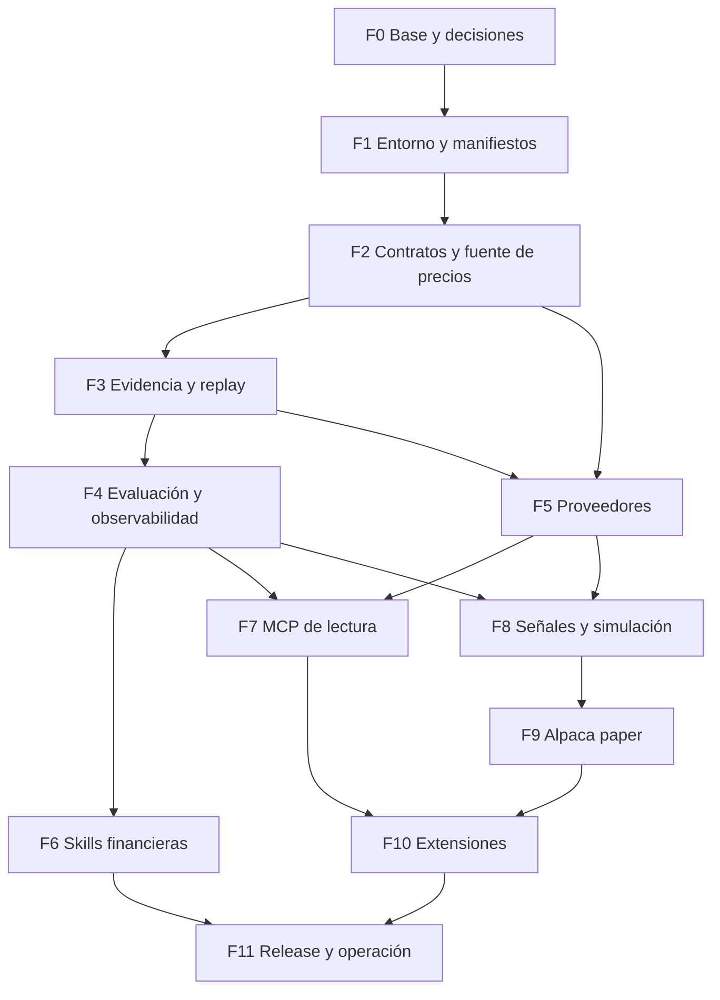

# Plan de implementación de TradingAgents

Estado: F0/F1 implementadas con validación local; CI remota bloqueada por facturación. F2 cerrada en lo esencial: contrato de precios, calendarios, disponibilidad (`availability_basis` / `available_not_before` ≠ retrieval), CLI `--cutoff`/`--calendar`, fundamentals tipados (SEC filing_date) y macro FRED con vintage. Pendiente menor F2→F5: unificar tool de indicadores y hashes de payload. Siguiente: F3 evidencia/replay.

Detalle de esta entrega: [contrato de precios](../../TradingAgents/docs/price-contract.md).
Base: [investigación del repositorio](2026-10-03_informe.md), checkout `8b22d43d01d9ddda5d686d093d5385884622f3de`.

## Objetivo y alcance

Evolucionar el proyecto hacia investigación financiera reproducible, datos verificables, evaluación comparativa, herramientas MCP, procedimientos financieros reutilizables, simulación de cartera y paper trading.

El plan cubre todos los recursos investigados. Donde varios productos resuelven la misma necesidad, define una primera implementación y un punto de extensión para alternativas. Soportar varias opciones no exige ejecutarlas simultáneamente ni añadir todas al paquete base.

Supuesto inicial de planificación: acciones/ETF de EE. UU., análisis diario y paper trading; extensiones de México y datos intradía en fases posteriores. La arquitectura conservará los mercados que ya soporta el proyecto. Operación con dinero real queda como hito independiente futuro; este plan no habilita órdenes reales.

## Decisiones de arquitectura propuestas

| Área | Primera entrega | Extensiones cubiertas |
|---|---|---|
| Entorno | uv, lock y CI existente | Extras independientes para integraciones |
| Persistencia | Manifiestos JSON, evidencia inmutable y Parquet; DuckDB para consulta | Backends adicionales sólo por necesidad de volumen |
| Calidad | Pydantic para contratos, Pandera para tablas, exchange_calendars para sesiones | Reglas específicas por mercado |
| Observabilidad | Phoenix local como supuesto por defecto, sujeto a prueba de compatibilidad | LangSmith o Langfuse mediante exportadores; elegir uno activo |
| Datos de precios | Alpaca primero por continuidad con paper; comparación con Yahoo | Massive como segundo adaptador; Databento para intradía |
| Fundamentales/macro | Ampliar SEC/FRED existentes; Financial Datasets opt-in | Banxico para macro mexicana |
| MCP | Adaptadores LangChain, catálogo explícito de lectura | Massive, Financial Datasets, Alpha Vantage, OpenBB, Alpaca |
| Skills | Cuatro skills de desarrollo y rúbrica de earnings | Comparables, DCF y revisión de tesis adaptados |
| Simulación | Contrato de señales y primer adaptador vectorbt | LEAN o Nautilus según necesidades; QLib como baseline ML |
| Broker | Adaptador Alpaca paper | IBKR paper después de comprobar acceso y semántica |

Estas selecciones son propuestas basadas en el informe, no compatibilidades ya demostradas. Fijar versiones al ejecutar cada fase y volver a comprobar documentación antes de usar comandos o endpoints externos.

## Dependencias

F0–F4 forman la ruta crítica. Las skills de desarrollo pueden comenzar en F1. Los proveedores pueden avanzar mientras se construye evaluación, una vez estable el contrato de datos. Ninguna orden paper se habilita antes de validar señales, límites e idempotencia.

## F0 — Preparación y decisiones

**Entregables:** inventario del estado actual, baseline de tests y documento de decisiones.

- Comprobar diferencias del checkout; preservar archivos del usuario, incluido `CLAUDE.md` no versionado observado.
- Instalar entorno aislado de desarrollo y ejecutar suite actual sin servicios externos. Registrar fallos preexistentes por separado.
- Confirmar mercado/horizonte, volumen esperado, presupuesto por corrida, proveedores disponibles y destino de trazas. No bloquear contratos y mocks por falta de cuentas.
- Definir perfiles: `research`, `replay`, `evaluation`, `simulation`, `paper`. Perfil por defecto: research.
- Registrar decisiones en `docs/adr/`, incluyendo por qué el evaluador actual se mantiene separado del simulador.

**Salida:** baseline documentado y alcance de primera release; ningún fallo nuevo se atribuye a integraciones todavía inexistentes.

## F1 — Entorno reproducible y manifiesto de ejecución

**Puntos de cambio:** `pyproject.toml`, CI, `graph/trading_graph.py`, `reporting.py`; nuevos módulos propuestos `runs/manifest.py` y `runs/store.py`.

- Resolver y versionar lock; conservar pruebas en Python 3.11–3.14. Verificar extras y entornos, sin bajar versiones silenciosamente.
- Agregar auditoría de dependencias resueltas con pip-audit; tratar excepciones justificadas con caducidad.
- Asignar `run_id`, `parent_run_id`, `schema_version`, estado y tiempos.
- Registrar commit, versión Python/dependencias, configuración efectiva saneada, hashes de prompts, modelo solicitado y versión resuelta cuando exista, parámetros de generación y huellas de memoria/cartera.
- Respetar configuración por corrida mediante `ContextVar`; no introducir globals mutables para nuevos proveedores.
- Mantener informes Markdown actuales y añadir manifiesto, sin exportar secretos ni URLs con credenciales.

**Aceptación:** reconstrucción del entorno desde lock en CI; dos runs concurrentes no mezclan configuración; manifiesto de una corrida fallida es legible; fixtures de credenciales quedan redactados.

## F2 — Contrato de datos, calidad y precios consistentes

**Puntos de cambio:** `dataflows/router.py`, `errors.py`, `agents/tools.py`, `vendors/yahoo/snapshot.py`, `memory/settlement.py`; nuevos `dataflows/contracts.py`, `validation.py`, `calendars.py`.

- Introducir un resultado tipado interno y conservar renderizadores de texto para herramientas existentes. Migrar por familia, con compatibilidad de firmas mientras duren los cambios.
- Campos de procedencia: proveedor/feed, instrumento, mercado, divisa/unidad, período, evento, publicación/disponibilidad, recuperación, cutoff, ajustes, URL y hash de payload.
- Diferenciar `unknown`, `not_applicable` y valores verificados. Nunca derivar disponibilidad histórica de la hora de descarga.
- Definir política para análisis por fecha: sesión/horario de corte explícito. Para nueva interfaz por instante, usar timestamps con zona; documentar qué endpoints sólo permiten granularidad diaria.
- Validar OHLCV y estados contables: tipos, duplicados, límites, relaciones high/low y unidades. No convertir reglas de acciones en reglas universales para futuros o datos sintéticos.
- Crear acceso compartido a barras/precios para herramientas, snapshot, indicadores y settlement. La valoración de outcomes puede consultar fechas posteriores sólo fuera del contexto del analista.
- Registrar benchmark/feed y método de ajuste; mantener cadena de fallback explícita.
- Añadir grillas por sesiones sin romper el modo calendario existente; reconocer sesiones parciales y datos obsoletos según mercado.

**Aceptación:** proveedor seleccionado se utiliza en todas las rutas previstas; tests de splits, festivos, DST, sesiones incompletas y falta de datos; información futura no llega al grafo analítico; renders actuales siguen funcionando.

## F3 — Archivo de evidencia y replay

**Módulos propuestos:** `evidence/models.py`, `store.py`, `replay.py`, `query.py`.

- Guardar evidencia original cuando los permisos lo permitan, respuesta normalizada, metadatos y relación herramienta→evidencia→run.
- Usar objetos inmutables identificados por hash, escrituras atómicas y un único escritor o cola para índices compartidos. Documentar concurrencia y recuperación de fallo.
- Guardar tablas en Parquet y habilitar consultas DuckDB. Separar caché mutable de archivo de experimento.
- Clave de replay: herramienta, argumentos normalizados, instrumento, cutoff, proveedor/feed, ajustes y versión del contrato.
- Ante evidencia ausente en replay: fallo explícito; nunca completar silenciosamente por red.
- Separar replay de datos de replay completo de respuestas LLM. El primero permite comparar modelos sobre evidencia idéntica; el segundo reproduce una ejecución registrada.
- Política de retención y borrado consistente con índices, manifiestos y permisos. Los datasets redistribuibles de tests serán sintéticos o autorizados.

**Aceptación:** corrida de datos en replay con sockets bloqueados; hashes y resultados estables; cambios de parámetros producen claves distintas; permisos de archivo quedan reflejados; reinicio no corrompe índice.

## F4 — Evaluación y observabilidad

**Puntos de cambio:** callbacks de `TradingAgentsGraph`, `backtest.py`; nuevos `evaluation/` y `observability/`.

- Correlacionar run, analista, LLM y herramientas. Capturar latencia, retries, tokens, errores, fallbacks de salida estructurada y costo cuando haya tarifa conocida. Costo desconocido se mantiene desconocido.
- Aplicar presupuesto por corrida con límites de llamadas/tokens; documentar que el costo final de una llamada ya iniciada puede exceder una estimación.
- Probar Phoenix con dos runs; si no encaja, elegir LangSmith o Langfuse mediante ADR. No instrumentar múltiples exportadores por defecto.
- Crear dataset inicial de 30–50 casos con evidencia fija; selección para regresiones, no para afirmar significancia financiera.
- Evaluadores determinísticos: cutoff, cita/evidencia existente, números, rating válido, datos faltantes y cumplimiento de presupuesto. Revisión humana para calidad de tesis; juez LLM sólo complementario.
- Comparar grafo completo, market-only, sin memoria y baseline determinístico; tres repeticiones exploratorias, memoria congelada y particiones temporales explícitas.
- Guardar retornos y métricas numéricas sin parsear porcentajes redondeados del Markdown; conservar lectura de logs antiguos y marcar su precisión.
- Comprobar sensibilidad al orden de tickers; reportar pendientes, excluidos y activos sin outcomes.

**Aceptación:** tablero/archivo permite rastrear una afirmación hasta su evidencia; ningún caso inválido temporal pasa el gate; comparación emparejada reproducible en datos; tests existentes siguen pasando. Umbrales de calidad y costo se fijan con baseline, antes de evaluar mejoras candidatas.

## F5 — Nuevos proveedores y enriquecimiento

Cada adaptador es un entregable separado; dependencias opcionales y credenciales fuera del repo.

| Integración | Alcance inicial | Aceptación específica |
|---|---|---|
| SEC/FRED | Ampliar procedencia, accession y vintage sobre implementación actual | Enmienda/revisión no altera evidencia histórica archivada |
| Alpaca Data | Barras y segundo feed; identificar feed contratado | Diferencias con Yahoo explicables por cobertura/ajustes, errores 401/403/429 distinguidos |
| Massive | Precios/noticias donde el plan lo permita | Contrato común y comparación contra conjunto fijo; sin fallback invisible |
| Financial Datasets | Estados y provenance; contraste contra SEC | Corte por publicación y enmiendas; bloquear uso PIT que no pueda demostrarse |
| Banxico | Series macro seleccionadas, unidades y versiones | Catálogo acotado, revisión histórica comprobada por serie; ausencia explícita |

Crear harness común: cobertura, calidad temporal, faltantes, discrepancias, latencia, llamadas y costo por análisis. Pasar mocks primero; pruebas autenticadas sólo con cuentas disponibles y presupuesto de integración definido. Falta de cuenta deja integración como `contract-tested`, no `validated-live`.

**Salida:** cada proveedor tiene ficha de capacidades, estado de validación y configuración por herramienta; ausencia del extra no impide usar el núcleo.

## F6 — Skills y procedimientos financieros

**Desarrollo:** crear `tradingagents-provider-contract`, `tradingagents-backtest-audit`, `tradingagents-research-review` y `tradingagents-release-check` bajo un directorio de skills del proyecto compatible con el host elegido.

**Runtime:** adaptar de forma explícita rúbricas de earnings, revisión de tesis, comparables y DCF a recursos versionados del paquete; no crear inicialmente un cargador universal de skills remotas.

- Fijar commit y atribuciones del material de Anthropic utilizado.
- Implementar cálculos financieros en funciones determinísticas; la narrativa recibe resultados, hipótesis y referencias.
- DCF requiere supuestos declarados y sensibilidades; comparables requieren selección de peers y unidades consistentes; earnings requiere publicación disponible al cutoff.
- Elegir procedimiento por configuración y horizonte; guardar su versión en manifiesto.
- Evaluar cada procedimiento frente al prompt anterior con evidencia idéntica.

**Aceptación:** tests de cálculos, falta de inputs tratada explícitamente, trazabilidad de cifras, ablation de costo/calidad y rollback por configuración. Una skill de desarrollo instalada no se anuncia como capacidad runtime.

## F7 — MCP y herramientas del desarrollador

**Entorno del desarrollador:** documentar perfiles para LangChain Docs/Reference, Context7 y GitHub MCP. Configuraciones de ejemplo sin secretos; fijar versiones de paquetes cuando proceda.

**Runtime:** nuevos `integrations/mcp/client.py`, `registry.py`, `adapter.py` detrás del contrato de datos.

- Lista permitida de servidores/herramientas por analista, configuración explícita, timeouts, cancelación, presupuesto, errores normalizados y hash de esquema.
- Manejar ciclo de sesiones y diferencia sync/async sin compartir estado incorrecto entre subgrafos paralelos.
- Conservar símbolo y cutoff inyectados por el backend; comprobar respuesta además de argumentos.
- Probar primero servidor controlado con Inspector y tests Python; después un servidor financiero de lectura.
- Añadir perfiles para Massive, Financial Datasets, Alpha Vantage y Alpaca; OpenBB como proceso separado opcional.
- Registrar descubrimiento vía MCP Registry como ayuda de selección, no como habilitación automática.

**Aceptación:** respuesta fuera de fecha rechazada, schema incompatible detectado, timeout cancelado y límite de herramientas mantenido. Operaciones de órdenes permanecen fuera de analistas; configuración del host de desarrollo y configuración del proceso Python están diferenciadas.

## F8 — Señales y simulación de cartera

**Nuevos módulos:** `signals/`, `simulation/`; mantener `backtest.py` como evaluador de decisiones.

- Crear `Signal` tipada con origen/run, evidencia, instrumento, instante de decisión, expiración, intención y versión de política.
- Si la salida fue sólo texto libre o inconsistente, registrar decisión para investigación pero no convertirla automáticamente en orden.
- Definir política determinística rating→peso objetivo, capital, moneda base, exposición máxima, instrumentos permitidos y reglas de rebalanceo.
- Exportar señales congeladas a vectorbt; separar generación LLM del loop de simulación.
- Definir fill posterior a disponibilidad de decisión, comisiones, spread/slippage, liquidez, eventos corporativos y tratamiento de faltantes.
- Métricas de cartera: curva de equity, drawdown, turnover, exposición y resultados netos; comparar contra buy-and-hold y baseline sencillo. Publicar exclusiones y parámetros.
- Añadir walk-forward, separación tuning/test y ventanas sin contaminación entre etiquetas solapadas; evaluación prospectiva para limitación del conocimiento LLM.

**Aceptación:** fixtures de ledger concilian caja+posiciones; modificar fee modifica resultado de forma previsible; ningún fill precede a señal; ninguna señal posterior entra en un período anterior; no se llama LLM durante replay del simulador.

## F9 — Alpaca paper trading

**Nuevo módulo:** `execution/` con interfaz de broker y almacenamiento durable de intenciones, órdenes y eventos.

- Adaptador paper con endpoint/configuración inequívocos y credenciales separadas.
- Checks determinísticos de antigüedad de señal, posición/caja, exposición, tamaño, horario e instrumento; un rating no salta directamente al broker.
- Estados de orden: intención, enviada, aceptada, parcial, completada, cancelada, rechazada y estado desconocido/reconciliación.
- Claves idempotentes, recuperación después de timeout y conciliación antes de reintentar; no prometer exactly-once sobre redes.
- `dry-run`, pausa de nuevas órdenes y cancelación de órdenes pendientes como acciones diferentes. Reinicios requieren conciliar con broker antes de continuar.
- CLI de operación con status, discrepancias y actividad; conservar IDs y eventos del broker.

**Aceptación:** caída entre envío y respuesta no duplica orden; fill parcial actualiza ledger; reinicio concilia; límite rechaza intención inválida; configuración rechaza endpoint live. Cerrar piloto tras suficientes sesiones y escenarios de fallo documentados, no por un número fijo de días rentables.

## F10 — Extensiones especializadas y alternativas

| Recurso | Trabajo planificado | Condición para activarlo |
|---|---|---|
| Databento | Adaptador histórico, symbology temporal y presupuesto por consulta | Requerimiento intradía/futuros/opciones y dataset contratado |
| OpenBB | Servicio separado con herramientas acotadas | Cobertura adicional medible frente a adaptadores directos |
| LangSmith / Langfuse | Exportadores alternativos y prueba de paridad de eventos | Preferencia operativa, reemplazo o necesidad de equipo |
| LEAN | Consumidor externo del contrato Signal y reconciliación de métricas | Necesidades de simulación no cubiertas por primera entrega |
| NautilusTrader | Adaptador de eventos, datos/fills y cuentas | Microestructura/ejecución más detallada |
| QLib | Baseline ML entrenado en particiones controladas | Comparativa ML justificada por datos y objetivo |
| IBKR | Consulta de cuenta y adaptador paper por separado | Cuenta/permisos disponibles; pruebas de contrato del broker |
| Alpaca CLI | Runbook de diagnóstico y operación con versión fijada | Interfaz estable validada en cuenta paper |

Cada extensión termina en prueba de concepto, comparación y decisión de integración; no se considera completada sólo por instalar el paquete. Si se desea implementar absolutamente todos los adaptadores, mantener cada uno como extra/servicio independiente y ampliar calendario/presupuesto.

## F11 — Release y operación

- Guías para configurar proveedores, replay, evaluación, simulación y paper; ejemplo reproducible sin claves con fixtures.
- Comandos CLI propuestos: `runs show`, `evidence inspect`, `replay`, `evaluate`, `providers check`, `simulate`, `paper status`. Son interfaces a diseñar, no comandos existentes.
- Actualizar README para distinguir análisis, evaluación de ratings, simulación y broker paper.
- Versionar schemas; migraciones explícitas e idempotentes, respaldos antes de migrar y lector compatible cuando sea viable.
- Rollout: integraciones apagadas por defecto → fixtures → integración acotada → experimento → habilitación por perfil.
- Rollback: desactivar adaptador/exportador y recuperar versión anterior compatible; no borrar evidencia ni volver a enviar órdenes durante rollback.
- Revisar fuentes, versiones y derechos al preparar release; changelog, smoke install y suite CI existente obligatorios.

**Aceptación:** recorrido documentado desde instalación hasta reporte y simulación con fixtures, restauración de persistencia probada, extras aislados y estado de todas las integraciones publicado.

## Hitos y estimación

Estimación preliminar en días de ingeniería, para una persona familiarizada con Python/LangGraph; no es fecha comprometida. Se recalibra tras F0–F2. Excluye esperas de cuentas, contratación de datos y observación prospectiva.

| Hito | Incluye | Esfuerzo aproximado |
|---|---|---|
| M1: investigación reproducible | F0–F4 | 22–35 días |
| M2: investigación enriquecida | F5–F7 | 22–36 días |
| M3: simulación y paper | F8–F9 | 20–35 días |
| M4: extensiones y release | F10–F11 | 18–40 días según alternativas elegidas |

Rango del programa: **82–146 días de ingeniería**, más observación externa. Con una persona, aproximadamente 17–30 semanas laborales antes de contingencia. Añadir un margen de planificación de 20–30% mientras contratos y proveedores sigan sin probar. Una entrega útil M1 llega mucho antes de cubrir todas las extensiones.

Datos, LLM, almacenamiento y observabilidad se presupuestan por separado. Antes de corridas grandes: medir llamadas/tokens por caso, repeticiones y precio por feed; establecer límite de gasto. No usar precios del informe como contrato vigente.

## Orden de los primeros cambios revisables

1. **PR-01:** ADR de alcance, baseline y entorno con lock; CI compatible.
2. **PR-02:** manifiesto de run y configuración saneada; informes existentes intactos.
3. **PR-03:** contrato de evidencia con puente a respuestas textuales y fixtures.
4. **PR-04:** acceso a precios común; eliminar bypass Yahoo de snapshot/settlement conservando defaults.
5. **PR-05:** archivo inmutable y replay de herramientas sin red.
6. **PR-06:** dataset de regresión y resultados numéricos precisos.
7. **PR-07:** observabilidad y experimento base; primera decisión de continuar o ajustar.

Cada PR incluye pruebas de comportamiento relevantes, documentación y reversión; no mezclar un nuevo broker con cambios de memoria o esquema. Las fases posteriores se dividen siguiendo el mismo tamaño.

## Definición global de terminado

Una funcionalidad está terminada cuando tiene contrato, implementación, pruebas apropiadas, configuración/documentación, trazabilidad y migración/rollback si afecta persistencia. Integraciones externas declaran `mock-tested`, `contract-tested` o `validated-live/paper`; no presentar mocks como conexión real. La release conserva garantías temporales, contratos de errores, aislamiento por corrida y comandos existentes.

Este documento planifica cambios; no constituye ejecución del plan ni demuestra rentabilidad. Las capacidades y fuentes externas se encuentran en el [informe](2026-10-03_informe.md) y su [índice de fuentes](sources.csv).
